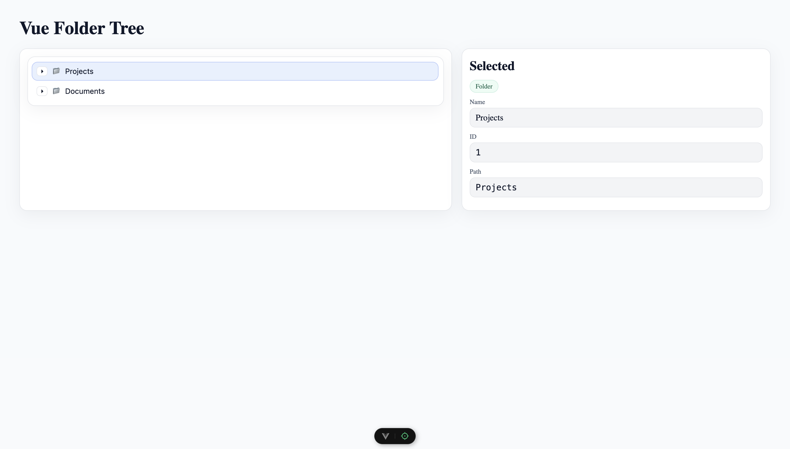
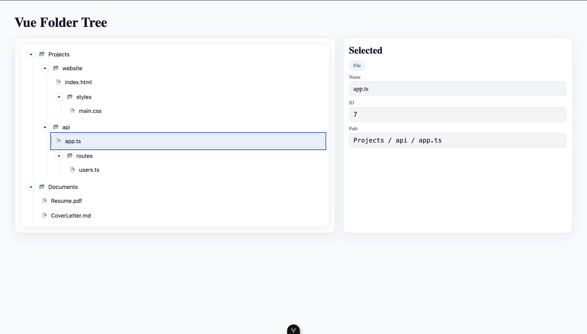

# 📂 Vue Folder Tree — Animated · Accessible · Accurate

A production-ready, recursive **folder tree component** built with **Vue 3 + Vite**.

---

## ✨ Features

* ✅ Smooth expand/collapse animations
* ✅ Keyboard navigation (`↑ ↓ Home End Space/Enter`)
* ✅ ARIA roles for screen readers
* ✅ Optional checkboxes
* ✅ Simple API (props + events)
* ✅ Zero dependencies

---

## 🔗 Live Demo

🌐 [https://luxenonbeterris.github.io/vue-folder-tree](https://luxenonbeterris.github.io/vue-folder-tree)

---

## 📦 Install & Run Locally

```bash
# install deps
pnpm install    # or: npm install / yarn

# start dev server
pnpm dev        # or: npm run dev
```

---

## 🖼 Screenshots

<p align="center">
  
  <br />
  
</p>

---

## 🗂 Data Model

```ts
type TreeNode = {
  id: string | number
  name: string
  isLeaf?: boolean
  children?: TreeNode[]
}
```

---

## 🛠 Tech & Scripts

**Stack:** Vue 3 · Vite · TypeScript SFCs

**Scripts:**

* `dev` — run locally
* `build` — production build
* `preview` — preview built app

---

## 📜 License

**MIT License**

* ✅ Free to use, modify, distribute
* ✅ Great for portfolio/demo use
* ❌ No warranty
